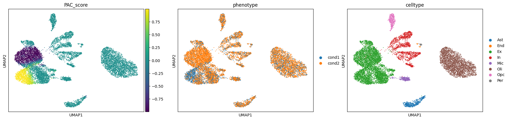

# Phenotype Associated Single Cell encoder (PASCode)

Phenotype Associated Single Cell encoder (PASCode) is a computational framework for phenotype scoring at the single-cell level. It integrates multiple differential abundance (DA) methods through an ensemble approach and leverages a graph attention network (GAT) to predict phenotype association scores for phenotype associated cells(PAC scores). Given single-cell sequencing data and a contrastive phenotypic label pair (e.g., disease vs. control), PASCode infers a PAC score for each cell, outperforming individual DA methods. PASCode combines existing DA methods, the Robust Rank Aggregation (RRA) algorithm, and trainable GAT models into unified Python-based interface. By standardizing inputs and outputs, it streamlines DA analysis by simplifying the running of these methods via user-friendly function calls.


## System requirements and dependencies
The code has been tested on Ubuntu 20.04 and Windows 12 with the following dependencies

Python version (**Note:** potential version issues may arise if using python>=3.13; we recommend installing PASCode in a new environment with the following tested python version)
```
python==3.10.12
```
Python packages
```
numpy==1.26.4
scipy==1.14.1
scanpy==1.10.2
pandas==2.0.3
anndata==0.10.3
multianndata==0.0.4
matplotlib==3.9.1
seaborn==0.13.2
cna==0.1.6
meld==1.0.2
rpy2==3.5.16
torch==2.3.0
torch_scatter=2.1.2
torch_sparse=0.6.18
torch_geometric==2.3.1
scikit-learn==1.5.2
```
R packages / DA methods:
```
Milo: milopy github repository as of Sep. 28 2024 
MELD: v1.0.2 
CNA: v0.1.6 
DAseq: v1.0.0 
RobustRankAggreg: v1.2.1
edgeR: v4.2.1
```
## Installation

PASCode is built upon existing DA methods and R packages, thus the user should install some of those methods (step 1) first before installing PASCode (step 2).

### Step 1: Install DA methods and RRA (2~3 min)

- The `RobustRankAggreg` R package must be installed for Robust Rank Aggregation (RRA) to get single-cell aggregated phenotype labels **(R)**. 
    ```r
    install.packages('RobustRankAggreg')
    ```
- `Milo` should be installed to be included in RRA **(Python)**.

  Follow instructions in https://github.com/emdann/milopy
  
  **Note:** After we completed PASCode, the authors of Milo began maintaining the package elsewhere. For PASCode, we should use the version linked above.

- `DAseq` should be installed to be included in RRA **(R)**.

  Follow instructions in https://github.com/KlugerLab/DAseq

- The rest of the DA methods will be automatically installed in step 2.

### Step 2: Install PASCode (2~3 min)

After completing step 1:

1) Download the PASCode repository from github, either by downloading the repository zip file or using git commands in a directory of interest:
```python
git init
git clone https://github.com/daifengwanglab/PASCode
```

2) Navigate to the PASCode directory, and run
```
pip install -r requirements.txt
```

#### Note:
The user may run into errors regarding *sparse tensor*. This is an existing issue (see https://github.com/pyg-team/pytorch_geometric/discussions/7866#discussioncomment-7970609) with the installation of PyG.

Also, in *requirements.txt*, we provided two wheel links to *torch_scatter* and *torch_sparse* to facilitate smooth installation, but those are compatible with the following settings only: *torch-2.3.0*, *python version 3.10*, *cuda version 12.1* on a *linux* machine. For compatibility with your local settings, look for corresponding links from https://data.pyg.org/whl/ and replace them in *requirements.txt*.

<!-- https://data.pyg.org/whl/torch-2.3.0%2Bcu121/torch_scatter-2.1.2%2Bpt23cu121-cp310-cp310-linux_x86_64.whl

https://data.pyg.org/whl/torch-2.3.0%2Bcu121/torch_sparse-0.6.18%2Bpt23cu121-cp310-cp310-linux_x86_64.whl -->


## Usage guide
### Step 1: Input data format
The input data should be an [anndata](https://anndata.readthedocs.io/en/stable/) object, with **already preprocessed** single-cell measurements data in `anndata.X` (`numpy.ndarray`) and subject-level information in `anndata.obs` (`pandas.DataFrame`). For example,

```python
import scanpy as sc
adata = sc.read_h5ad('./data/synth_demo_2v6_sparse.h5ad')
print(adata)
```
```
AnnData object with n_obs × n_vars = 11674 × 2000
    obs: 'celltype', 'phenotype', 'subject_id'
```
```python
adata.X = adata.X.toarray()
print(adata.X)
```
```
[[0.        0.        0.        ... 0.        1.1308908 0.       ]
 [0.        0.        0.        ... 0.        0.        0.       ]
 [0.        0.        0.        ... 0.        0.        0.       ]
 ...
 [0.        0.        0.        ... 0.        0.        0.       ]
 [2.4369774 0.        0.        ... 2.4369774 0.        0.       ]
 [0.        0.        0.        ... 0.        0.        0.       ]]
```
```python
import anndata
print(adata.obs)
```
```
                    celltype phenotype subject_id
TAG                                              
AACTGGTGTACCGGCT.1        Ex     cond1         21
AAGACCTAGTTAACGA.1        Ex     cond1         21
ACATCAGCAGGCTCAC.1        Ex     cond1          2
ACGAGGATCCATTCTA.1        Ex     cond1          2
ATCATCTGTGGACGAT.1        Ex     cond2         34
...                      ...       ...        ...
GCACATACATGCCTTC.40      End     cond2         43
GCCTCTACACTTAACG.44      Per     cond1         21
GTGCGGTCAATCGGTT.46      End     cond2         29
CACACTCTCTCTGAGA.48      Per     cond1          2
TGCCCATAGTAGGTGC.48      Per     cond1         21

[11674 rows x 3 columns]
```
Make sure `adata.obs` (`pandas.DataFrame`) has at least the following:
- single-cell IDs as indices (e.g. the 'TAG' indices 'AACTGGTGTACCGGCT.1, ...')
- a *subject ID* column for the IDs of subjects (e.g., 'subject_id' above).
- a *condition* column, indicating either a positive condition (e.g., AD) or a negative condition (e.g., Control) for the subject (e.g., 'phenotype' above).

We can take a look at subject-level information w.r.t. any subject-level labels of interest, together with subject ID:

```python
subid_col = 'subject_id' # specify the column name for subject IDs
import PASCode
dinfo = PASCode.utils.subject_info(
    adata.obs,
    subid_col=subid_col,
    # specify the subject-level column names to summarize (must be subject-level)
    columns=['Sex', 'Age'] # e.g. count subject numbers for sex and age
)
print(dinfo)
```

If you need to **create a new** `anndata` object, you can easily do so via the `andata.AnnData` class by providing at least
- a preprocessed single-cell measurements `X` (e.g., single-cell RNA-seq) with cells as rows and features as columns. \
**Note: make sure `X` is preprocessed, at the very least log-normalized**, if not standard-scaled (PASCode will automatically perform standard scaling, which is strongly recommended for procedures like PCA and GAT training to achieve higher accuracy and stability).
- a single-cell observation information dataframe, including celltype, phenotype, subject_id, etc.
```python
adata = anndata.AnnData(X=X, obs=obs)
```

### Step 2: Balance donor numbers via subsampling

Skip this step if subject numbers in the contrastive condition pair are already balanced ($\frac{n_{larger}}{n_{smaller}}= 1$).

In our benchmark experiments, we found that DA methods are more accurate for balanced donor numbers between the positive condition ($n_1$) and negative condtion ($n_2$). Unless $n_1$ and $n_2$ are highly close, subsampling is almost always recommended to alleviate performance degradation.

The (approximate) **rule-of-thumb** regarding whether you should perform this subsampling step:
 
if $\frac{n_{larger}}{n_{smaller}}\ge 0.75$, subsample may not be necessary; otherwise, perform subsampling.

This is particularly necessary for population-level datasets. For example, for PsychAD's AD contrast, we have 314 AD subjects and 111 Controls, which is highly imbalanced. Running DA and RRA directly on the whole dataset would lead to low accuracy, inhibiting meaningful downstream analysis.

Therefore, in our analysis, we took 100 AD vs. 100 Controls as train set for running DA methods and RRA to get *aggregated phenotype labels*, then trained a GAT model with this train set and a 11 AD vs. 11 Controls validation set (for early stopping to obtain the best model). We then use the trained GAT model to infer PAC scores for the whole dataset (i.e., 314 AD vs. 111 Controls).
 
```python
"""This function will automatically subsample subjects to the smaller number in the two conditions.
For instance, 2v6 -> 2v2
"""
# adata0 will be used for complete PAC score annotation using GAT later in Step 4
adata0 = adata.copy()

# specify required column names, and the labels for the contrastive condition pair
subid_col = 'subject_id'
cond_col = 'phenotype'
print(adata.obs[cond_col].value_counts())
pos_cond = 'cond1'
neg_cond = 'cond2'

adata = PASCode.utils.subsample_donors(
    adata=adata,
    subid_col=subid_col,
    cond_col=cond_col,
    pos_cond=pos_cond,
    neg_cond=neg_cond,
    sex_col=None, # Specify the column name for sex in adata.obs to account for sex balance during subsampling. Default: None.
    mode='top' # Keep subjects with the largest number of cells. Default: 'top'.
)
```
```
Before donor subsampling:
phenotype
cond2    6
cond1    2
Name: count, dtype: int64
'subsample_num' not provided. Automatically subsampling to the smaller number of subjects in the two conditions.
Donor subsampling:  2:2
After donor subsampling:
phenotype
cond2    2
cond1    2
Name: count, dtype: int64
```

### Step 3: Run DA methods and RRA
We have a convenient function call to run DA methods and RRA to directly get the *aggregated phenotype labels*:
```python
adata.obs['aggreg_label'] = PASCode.da.agglabel(
    adata,
    subid_col,
    cond_col,
    pos_cond,
    neg_cond,
    da_methods=['milo','meld','daseq'] # recommended/default combination that yields high accuracy
)
```

### Step 4: GAT for annotating PAC scores for the whole dataset

```python
# We need to transfer the aggregated labels from the subsampled dataset back to the original dataset.
adata.obs.loc[adata_sub.obs.index, 'aggreg_label'] = adata_sub.obs['aggreg_label']

# Prepare Training and Validation Masks
PASCode.model.get_val_mask(
    adata_sub, 
    subid_col=subid_col,
    cond_col=cond_col,
    pos_cond=pos_cond,
    neg_cond=neg_cond
)

# Assign masks to the original dataset
adata.obs['val_mask'] = adata.obs.index.isin(
    adata_sub.obs[adata_sub.obs['val_mask']].index
)
adata.obs['train_mask'] = adata.obs.index.isin(
    adata_sub.obs[adata_sub.obs['train_mask']].index
)

# train model
model = PASCode.model.train_model(
    adata=adata,
    agglabel_col='aggreg_label',
    device='cuda:0' # NOTE change accordingly
)

# predict pac score
adata.obs['PAC_score'] = model.predict(adata)

sc.tl.umap(adata)
sc.pl.umap(adata, color=['PAC_score', 'phenotype', 'celltype'])

```


Toy data total running time (including running Milo, MELD, DAseq, and traininig GAT model): 3min.

PASCode running time can vary across systems and various use cases. 

Except for the above simple usage guide, we provide tutorials (*Tutorial_PASCode-RRA.ipynb*, *Tutorial_PASCode-ScorePrediction.ipynb*) to guide users for more customizations. Users can refer to these two tutorials for more customized, efficient, and accurate PAC scoring.

## Reference

Chenfeng He, Athan Z. Li, Kalpana Hanthanan Arachchilage, Chirag Gupta, Xiang Huang, Xinyu Zhao, PsychAD Consortium, Kiran Girdhar, Georgios Voloudakis, Gabriel E. Hoffman, Jaroslav Bendl, John F. Fullard, Donghoon Lee, Panos Roussos,  Daifeng Wang. *Phenotype Scoring of Population Scale Single-Cell Data Dissects Alzheimer's Disease Complexity*. doi: https://doi.org/10.1101/2024.11.01.24316586.
