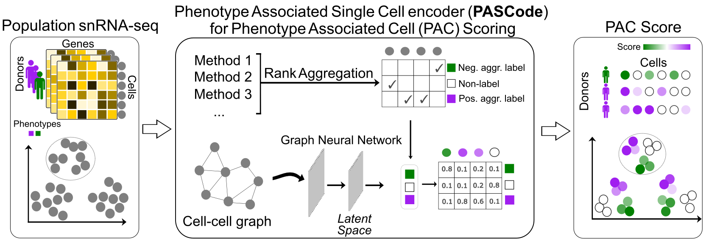

# Phenotype Associated Single Cell encoder (PASCode)

Phenotype Associated Single Cell encoder (PASCode) is a computational framework for phenotype scoring at the single-cell level. It integrates multiple differential abundance (DA) methods through an ensemble approach and leverages a graph attention network (GAT) to predict phenotype association scores for phenotype associated cells(PAC scores). Given single-cell sequencing data and a contrastive phenotypic label pair (e.g., disease vs. control), PASCode infers a PAC score for each cell, outperforming individual DA methods. PASCode combines existing DA methods, the Robust Rank Aggregation (RRA) algorithm, and trainable GAT models into unified Python-based interface. By standardizing inputs and outputs, it streamlines DA analysis by simplifying the running of these methods via user-friendly function calls.



## System requirements and dependencies
The code has been tested on Ubuntu 20.04 and Windows 12 with the following dependencies

Python version (**Note:** potential version issues may arise if using python>=3.13; we recommend installing PASCode in a new environment with the following tested python version)
```
python==3.10.12
```
Python packages
```
numpy==1.26.4
scipy==1.14.1
scanpy==1.10.2
pandas==2.0.3
anndata==0.10.3
multianndata==0.0.4
matplotlib==3.9.1
seaborn==0.13.2
cna==0.1.6
meld==1.0.2
rpy2==3.5.16
torch==2.3.0
torch_scatter=2.1.2
torch_sparse=0.6.18
torch_geometric==2.3.1
scikit-learn==1.5.2
```
R packages / DA methods:
```
Milo: milopy github repository as of Sep. 28 2024 
MELD: v1.0.2 
CNA: v0.1.6 
DAseq: v1.0.0 
RobustRankAggreg: v1.2.1
edgeR: v4.2.1
```
## Installation

PASCode is built upon existing DA methods and R packages, thus the user should install some of those methods (step 1) first before installing PASCode (step 2).

### Step 1: Install DA methods and RRA (2~3 min)

- The `RobustRankAggreg` R package must be installed for Robust Rank Aggregation (RRA) to get single-cell aggregated phenotype labels **(R)**. 
    ```r
    install.packages('RobustRankAggreg')
    ```
- `Milo` should be installed to be included in RRA **(Python)**.

  Follow instructions in https://github.com/emdann/milopy
  
  **Note:** After we completed PASCode, the authors of Milo began maintaining the package elsewhere. For PASCode, we should use the version linked above.

- `DAseq` should be installed to be included in RRA **(R)**.

  Follow instructions in https://github.com/KlugerLab/DAseq

- The rest of the DA methods will be installed automatically along with PASCode in step 2.

### Step 2: Install PASCode (2~3 min)

After completing step 1:

1) Download the PASCode repository from github, either by downloading the repository zip file or using git commands in a directory of interest:
```python
git init
git clone https://github.com/daifengwanglab/PASCode
```

2) Navigate to the PASCode directory, and run
```
pip install -r requirements.txt
```

#### Note:
The user may run into errors regarding *sparse tensor*. This is an existing issue (see https://github.com/pyg-team/pytorch_geometric/discussions/7866#discussioncomment-7970609) with the installation of PyG.

Also, in *requirements.txt*, we provided two wheel links to *torch_scatter* and *torch_sparse* to facilitate smooth installation, but those are compatible with the following settings only: *torch-2.3.0*, *python version 3.10*, *cuda version 12.1* on a *linux* machine. For compatibility with your local settings, look for corresponding links from https://data.pyg.org/whl/ and replace them in *requirements.txt*.

<!-- https://data.pyg.org/whl/torch-2.3.0%2Bcu121/torch_scatter-2.1.2%2Bpt23cu121-cp310-cp310-linux_x86_64.whl

https://data.pyg.org/whl/torch-2.3.0%2Bcu121/torch_sparse-0.6.18%2Bpt23cu121-cp310-cp310-linux_x86_64.whl -->


## Usage guide
### Step 1: Input data format
The input data should be an [anndata](https://anndata.readthedocs.io/en/stable/) object, with expression data in `anndata.X` and subject-level information in `anndata.obs`. For example,

```python
import scanpy as sc
adata = sc.read_h5ad('./data/synth_data_2v6.h5ad')
print(adata)
```

```python
print(adata.X)
print(adata.X.shape)
```

```python
print(adata.obs)
```

Make sure adata.obs has at least the following two columns:
1. a *subject ID* column for the IDs of subjects.
2. a *condition* column, indicating either a positive condition (e.g., AD) or a negative condition (e.g., Control) for the subject.

We can take a look at subject-level information w.r.t. any subject-level labels of interest, together with subject ID:

```python
subid_col = 'Donor ID' # specify the column name for subject IDs
import PASCode
dinfo = PASCode.utils.subject_info(
    d.obs,
    subid_col=subid_col,
    columns=['Sex','Braak'] # e.g. count donor numbers for sex and braak stages 
)
print(dinfo)
```


### Step 2: Balance donor numbers

DA methods are more accurate for balanced donor numbers between the positive condition (n1) and negative condtion (n2). Unless n1 and n2 are extremely close, subsampling is almost always recommended to avoid accuracy loss.

```python
"""
This function will automatically subsample to the minimum number of subjects in the two conditions.
"""
adata0 = adata.copy() # adata0 will be used for complete PAC score annotation using GAT later in Step 4
adata = PASCode.utils.subsample_donors(
    adata=adata,
    subid_col=subid_col,
    cond_col=cond_col,
    pos_cond=pos_cond,
    neg_cond=neg_cond,
    sex_col=None, # Specify the column name for sex_col in adata.obs to also account for sex balance.
    mode='top' # Keep subjects with the largest number of cells
)
```

Before donor subsampling:
phenotype
cond2    6
cond1    2
Name: count, dtype: int64
'subsample_num' not provided. Automatically subsample to the minimum number of subjects in the two conditions.
Donor subsampling:  2:2
After donor subsampling:
phenotype
cond2    2
cond1    2
Name: count, dtype: int64

### Step 3: Run DA methods

```python
# Specify positive and negative condition names in condition column
pos_cond = 'cond1'
neg_cond = 'cond2'

adata.obs['aggreg_label'] = PASCode.da.agglabel(
    adata,
    subid_col,
    cond_col,
    pos_cond,
    neg_cond
)
```

### Step 4: GAT for annotating PAC scores

```python
# We must transfer the aggregated labels from the subsampled dataset back to the original dataset.
adata.obs.loc[adata_sub.obs.index, 'aggreg_label'] = adata_sub.obs['aggreg_label']

# Prepare Training and Validation Masks
PASCode.model.get_val_mask(
    adata_sub, 
    subid_col=subid_col,
    cond_col=cond_col,
    pos_cond=pos_cond,
    neg_cond=neg_cond
)

# Assign masks to the original dataset
adata.obs['val_mask'] = adata.obs.index.isin(
    adata_sub.obs[adata_sub.obs['val_mask']].index
)
adata.obs['train_mask'] = adata.obs.index.isin(
    adata_sub.obs[adata_sub.obs['train_mask']].index
)

# train model
model = PASCode.model.train_model(
    adata=adata,
    agglabel_col='aggreg_label',
    device='cuda:0' # NOTE change accordingly
)

# predict pac score
adata.obs['PAC_score'] = model.predict(adata)

sc.tl.umap(adata)
sc.pl.umap(adata, color=['PAC_score', 'phenotype', 'celltype'])

```


Toy data total running time (including running Milo, MELD, DAseq, and traininig GAT model): 3min.

PASCode running time can vary across systems and various use cases. 

Except for the above simple usage guide, we provide tutorials (*Tutorial_PASCode-RRA.ipynb*, *Tutorial_PASCode-ScorePrediction.ipynb*) to guide users for more customizations. Users can refer to these two tutorials for more customized, efficient, and accurate PAC scoring.

## Reference

Chenfeng He, Athan Z. Li, Kalpana Hanthanan Arachchilage, Chirag Gupta, Xiang Huang, Xinyu Zhao, PsychAD Consortium, Kiran Girdhar, Georgios Voloudakis, Gabriel E. Hoffman, Jaroslav Bendl, John F. Fullard, Donghoon Lee, Panos Roussos,  Daifeng Wang. *Phenotype Scoring of Population Scale Single-Cell Data Dissects Alzheimer's Disease Complexity*. doi: https://doi.org/10.1101/2024.11.01.24316586.
